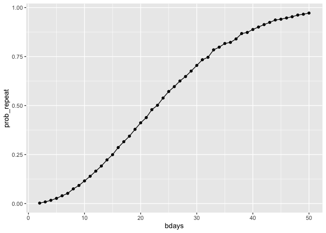
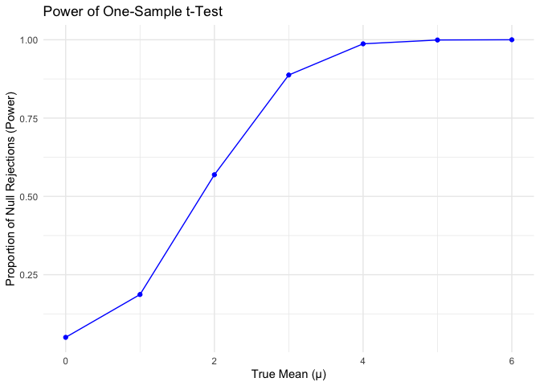
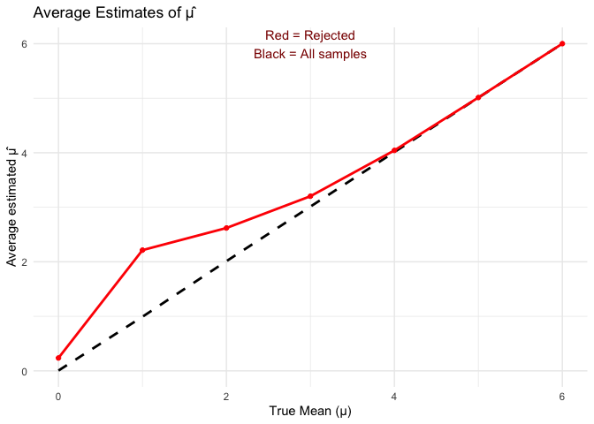
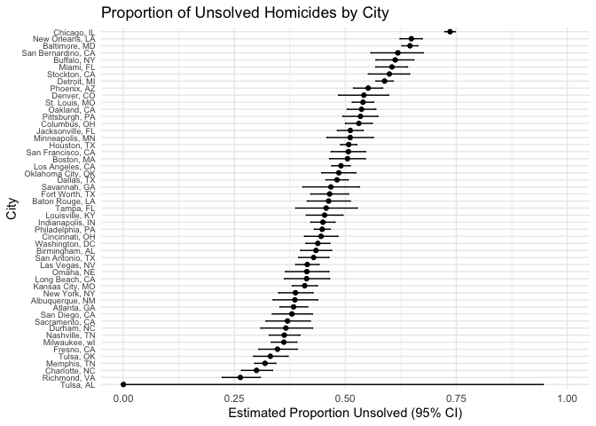

p8105_hw5_kiu2103
================
2025-11-13

## Problem 1

``` r
bday_sim = function(n_room){
  birthdays = sample(1:365, n_room , replace = TRUE)
  repeated_bday = length(unique(birthdays)) < n_room
  repeated_bday
}

bday_sim_results = 
  expand_grid( 
    bdays = 2:50,
    iter = 1:10000,
  ) |>
  mutate(
    result = map_lgl(bdays, bday_sim)
  ) |>
  group_by(
    bdays
  ) |>
  summarize(
    prob_repeat = mean(result)
  )

bday_sim_results |>
  ggplot(aes(x = bdays, y = prob_repeat)) +
  geom_point() +
  geom_line()
```

<!-- -->

The plot shows the probability that at least two people share a birthday
as group size increases as the number of people increase from 2 to 50.
The probability grows slowly at first but then increases rapidly,
reaching:</br> - ~50% at 23 people</br> - ~70% at 30 people</br> - ~90%
at around 40 people</br> - ~97% by 50 people</br>

## Problem 2

``` r
results = 
  expand_grid(mu = 0:6, sim = 1:5000) |>
  mutate(
    data = map(mu, ~ rnorm(n=30, mean = .x, sd = 5)),
    test = map(data, ~ t.test(.x, mu = 0)),
    tidy = map(test, tidy)
  ) |>
  unnest(tidy) |>
  select(mu, estimate, p.value)

summary_df = 
  results |>
  group_by(mu) |>
  summarise(
    power = mean(p.value < 0.05),
    mean_est = mean(estimate),
    mean_est_reject = mean(estimate[p.value < 0.05]),
    .groups = "drop"
  )

ggplot(summary_df, aes(x = mu, y = power)) +
  geom_line(color = "blue") +
  geom_point(color = "blue") +
  labs(
    title = "Power of One-Sample t-Test",
    x = "True Mean (μ)",
    y = "Proportion of Null Rejections (Power)"
  ) +
  theme_minimal()
```

<!-- -->

``` r
ggplot(summary_df, aes(x = mu)) +
  geom_line(aes(y = mean_est), color = "black", size = 1, linetype = "dashed") +
  geom_line(aes(y = mean_est_reject), color = "red", size = 1) +
  geom_point(aes(y = mean_est_reject), color = "red") +
  labs(
    title = "Average Estimates of μ̂",
    x = "True Mean (μ)",
    y = "Average estimated μ̂"
  ) +
  theme_minimal() +
  annotate("text", x = 3, y = 6, label = "Red = Rejected\nBlack = All samples", color = "darkred")
```

    ## Warning: Using `size` aesthetic for lines was deprecated in ggplot2 3.4.0.
    ## ℹ Please use `linewidth` instead.
    ## This warning is displayed once every 8 hours.
    ## Call `lifecycle::last_lifecycle_warnings()` to see where this warning was
    ## generated.

<!-- -->

Power is increases with μ. Larger effect sizes produce larger test
statistics on average, so the probability of rejecting a false null
hypothesis increases. Power increases with effect size because larger
deviations from the null hypothesis produce larger test statistics and
make it easier to detect the true effect.

Is the sample average of 𝜇̂ across tests for which the null is rejected
approximately equal to the true value of 𝜇? Why or why not?

No, the average of μ̂ from only the tests that reject the null is not
equal to the true μ when μ is small, but get closer when μ is larger.
This happens because (in the case of the smaller μ) we are only looking
at the particular samples where the sample mean came out unusually big
just by chance. Those rare big estimates are the only ones that can make
the test significant, so the average ends up too high.When μ is large,
this problem goes away because almost every test rejects the null. Since
we’re not filtering out many samples, the average estimate is close to
the true value.

## Problem 3

``` r
homicides <- read_csv("https://raw.githubusercontent.com/washingtonpost/data-homicides/master/homicide-data.csv")
```

    ## Rows: 52179 Columns: 12
    ## ── Column specification ────────────────────────────────────────────────────────
    ## Delimiter: ","
    ## chr (9): uid, victim_last, victim_first, victim_race, victim_age, victim_sex...
    ## dbl (3): reported_date, lat, lon
    ## 
    ## ℹ Use `spec()` to retrieve the full column specification for this data.
    ## ℹ Specify the column types or set `show_col_types = FALSE` to quiet this message.

The homicides data frame contains 52179 rows and 12 columns, with
homicide data from 50 major US cities. It includes the variables uid,
reported_date, victim_last, victim_first, victim_race, victim_age,
victim_sex, city, state, lat, lon, disposition, which provide
information about each homicide case such as the unique ID, report date,
victim demographics, location, and case disposition.

``` r
city_summary <- homicides |>
  mutate(city_state = str_c(city, ", ", state)) |>
  group_by(city_state) |>
  summarise(
    total = n(),
    unsolved = sum(disposition %in% c("Closed without arrest", "Open/No arrest")),
    .groups = "drop"
  )

baltimore_results <- city_summary |>
  filter(city_state == "Baltimore, MD") |>
  summarise(
    tidy = list(
      prop.test(
        x = unsolved,
        n = total
      ) |> broom::tidy()
    )
  ) |>
  unnest(tidy) |>
  select(estimate, conf.low, conf.high)


city_results <- city_summary |>
  mutate(
    test = map2(unsolved, total, \(x, n) prop.test(x, n)),
    tidy = map(test, broom::tidy)
  ) |>
  select(-test) |>
  unnest(tidy) |>
  select(city_state, total, unsolved, estimate, conf.low, conf.high)
```

    ## Warning: There was 1 warning in `mutate()`.
    ## ℹ In argument: `test = map2(unsolved, total, function(x, n) prop.test(x, n))`.
    ## Caused by warning in `prop.test()`:
    ## ! Chi-squared approximation may be incorrect

``` r
city_results |>
  arrange(estimate) |>
  mutate(city_state = fct_reorder(city_state, estimate)) |>
  ggplot(aes(x = city_state, y = estimate)) +
  geom_point() +
  geom_errorbar(aes(ymin = conf.low, ymax = conf.high), width = 0.2) +
  coord_flip() +
  scale_y_continuous(limits = c(0, 1)) + 
  labs(
    title = "Proportion of Unsolved Homicides by City",
    x = "City",
    y = "Estimated Proportion Unsolved (95% CI)"
  ) +
  theme_minimal()+
  theme(
    axis.text.y = element_text(size = 7),
  )
```

<!-- -->
